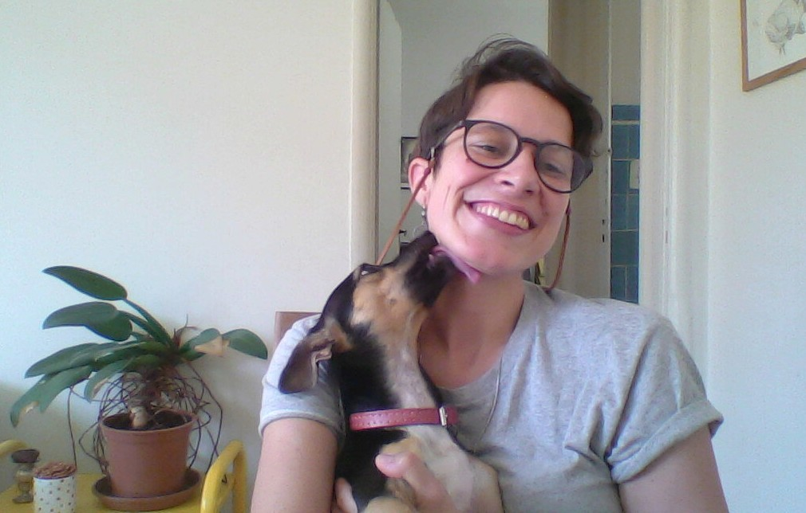

{width=50%}

sou cientista, usuária de software livre e de código aberto, interessada em pedalar, dançar, cozinhar (de preferência com uma balança e frequentemente com experimentações controladas de ingredientes) e entender padrões gerais de diversidade.

[Sara Mortara](https://twitter.com/MortaraSara)

se quiser saber sobre meu trabalho, [aqui](http://lattes.cnpq.br/1367565226603309) está

