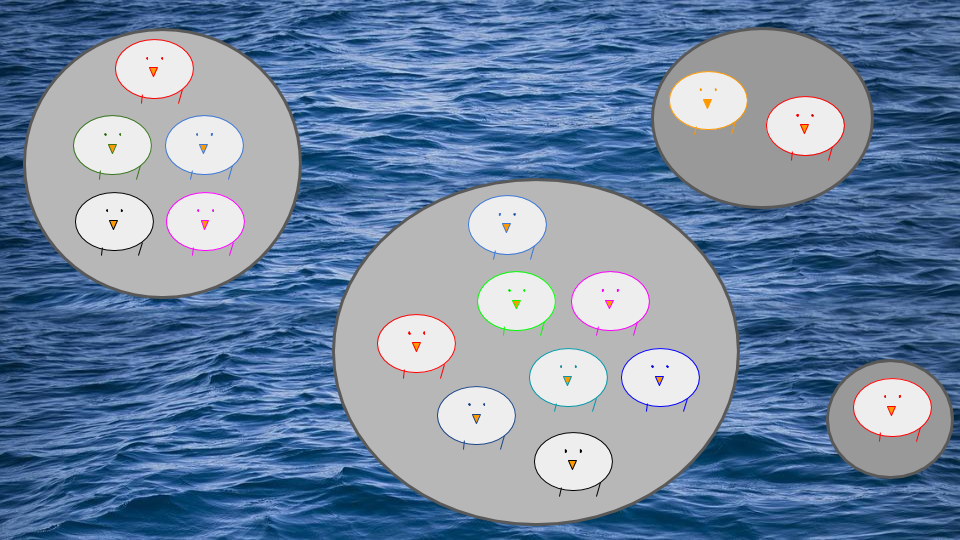

## Bem vindo(a) ao R

Os dez mandamentos do R pelo professor [Alexandre Adalardo de Oliveira](http://ecologia.ib.usp.br/bie5782/doku.php?id=bie5782:dezmanda) da USP: 

- 0º - Não entrarás em pânico!
- 1º-  Utilizarás o R para tuas análises bem como para a manipulação de teus dados (não mais o Excel);
- 2º - Nunca digitarás o código no console;
- 3º - Salvarás seus scripts e não se preocuparás com o .RData;
- 4º - Sempre concatenarás;
- 5º - Jamais esquecerás dos parênteses das funções;
- 6º - Conferirás o diretório de trabalho e os dados após a importação, antes de enlouqueceres;
- 7º - Usarás o help antes de perguntares e não culparás o R por teus erros;
- 8º - Não esmorecerás após as primeiras noites em claRo e jamais amaldiçoarás o R por tuas faltas de vírgulas;
- 9º - Lembrarás das aspas dos caracteres;
- 10º- Não cobiçarás e aperfeiçoarás os códigos alheios e nunca ocultarás o código e a autoria original;

## Uma introdução

Vamos sempre abrir o R e um arquivo de texto onde iremos digitar os comandos. O primeiro passo é definir o diretório de trabalho onde você irá trabalhar com o R. Lembre-se sempre: **você** digita os comandos e o R executa. 

### Definindo o diretório de trabalho

Antes de tudo, vamos checar em qual o diretório o R está aberto usando a função <tt> getwd</tt>:

```{r}
# use a função getwd para checar o diretorio de trabalho
getwd()
```

Vamos então definir um novo diretório de trabalho. Recomendo que você crie um diretório chamado 'atividadesR' em seu computador, que contenha todos os arquivos e pastas do 'atividadesR' no google drive da disciplina. Vamos manter os dados dentro da pasta 'dados' nesse mesmo diretório. As atividades da aula teórica estão no diretório 'teorica' e as práticas (como esta), no diretório 'praticas'. Neste momento, vamos trabalhar dentro do diretorio 'praticas'. Se você já está à vontade com o R e prefere organizar de outra forma, vá em frente! Esta é apenas uma recomendação para que os códigos da aula funcionem diretamente no computador de vocês. 


**Atenção 1**: usuários de Linux e Mac devem usar uma barra / para separar os diretórios. Usuários de Windows devem usar a barra invertida \\ ou duas barras //.  

**Atenção 2**: o comando abaixo funciona apenas para o computador da Sara. Defina o seu próprio caminho. 

```{r echo=FALSE}
# use a função setwd para definir o diretório que você irá trabalhar
# este exemplo, funciona para o meu caso, encontre o caminho que funciona para o seu
#setwd("/home/sara/Dropbox/posdoc/disciplina_modelagem/atividadesR/praticas")
```

Verifique se a mudança de diretório funcionou usando novamente a função 
 <tt> getwd</tt>:

```{r}
# use a função getwd para checar o diretorio de trabalho
getwd()
```

Verifique os arquivos que estão no diretório:

```{r}
# use a função dir para checar os arquivios que estão no diretorio de trabalho
dir()
```

E também verifique se o *workspace* do R está vazio:

```{r}
# para listar os objetos existentes na sua área de trabalho (deve estar vazio)
ls()
```

### Quem faz o R?

O a criação e manutenção do R depende de uma grande equipe. Para saber como citar o R use é só usar a função <tt> citation </tt>:

```{r}
citation()
```


### Criando objetos

No R você pode guardar o resultado de um comando usando uma operação de atribuição. Podemos usar os três operadores de atribuição <-, = e -> podem ser usados de várias maneiras para criar objetos. Por exemplo, estes comandos:

```{r}
# cria o objeto 'a' que recebe a raiz quadrada de 4
a <- sqrt(4)
# cria o objeto 'b' que recebe a raiz quadrada de 4
b = sqrt(4)
# cria o objeto 'c' que recebe a raiz quadrada de 4
sqrt(4) -> c
```

Vamos ver?

```{r}
# visualizando o objeto 'a'
a
# visualizando o objeto 'b'
b
# visualizando o objeto 'c'
c
```

Agora, se pedirmos a lista dos objetos na área de trabalho teremos:

```{r}
# listando todos os objetos da área de trabalho, agora deve aparecer os objetos criados
ls()
```

Se a atribuição é para um objeto que não existe, esse objeto é criado. Mas cuidado: se já há um objeto com o mesmo nome na sua área de trabalho, seus valores serão substituídos:


```{r cars}
# criando o objeto a que recebe a raiz quadrada de 4
a <- sqrt(4)
# visualizando o objeto 'a'
a
# criando um novo objeto 'a' que recebe o número '100'
a <- 10^2
# visualizando o novo objeto 'a'
a
```


### Como conseguir ajuda no R

Formas de {width=7%}:

- A página de ajuda do R
- Coleguinhas
- A grande rede "*how to do anova in R*" 

```{r}
# para acessar a pagina de ajuda de uma função usamos a função 'help'
help(mean)
```

```{r}
# uma outra forma de acessar a página de 'ajuda'
?mean
```

### Lendo um arquivo de dados no R

Na maior parte do tempo, usaremos o R para ler um conjunto de dados do nosso próprio trabalho. Para ler os seus dados no R é necessário que eles estejam em formato de texto .txt ou .csv. Usualmente, organizamos os dados como uma variável por coluna e uma observação por linha. 

Vamos ver um exemplo com os dados do arquivo 'exemplo-caixeta.csv' que está no diretório 'atividadesR' -> 'dados'.

Esta parte da prática é adaptada dos tutoriais do professor [João Batista](http://cmq.esalq.usp.br/wiki/doku.php?id=publico:tutoriais:r-relampago:start) da ESALQ-USP.


Para ler o arquivo e gravá-lo num objeto vamos usar o comando abaixo:

```{r}
# estamos atribuindo ao objeto cax a planilha em csv
cax = read.csv(file="dados/exemplo-caixeta.csv")
```
 se você digitar o nome do objeto:

```{r}
cax
```

o R lhe apresentará todas as 198 linhas de dados!!

Para visualizar apenas as primeiras linhas do dataframe (objeto de dados) use o comando head:

```{r}
# para visualizar as apenas as seis primeiras linhas do objeto
head(cax)
```

Para entender a estrutura do objeto, podemos usar os comandos <tt> str </tt> e <tt> summary </tt>:

O primeiro mostra a estrutura do objeto:

```{r}
# checando a estrutura do objeto
str(cax)
```

E o segundo mostra um sumário de todas as variáveis do objeto:

```{r}
# sumário das variáveis do objeto cax
summary(cax)
```

### Manipulando e Criando Variáveis

O comando head sempre apresenta as primeiras linhas da tabela de dados (data frame).

As colunas da tabela (variáveis) são mostradas pelos nomes que estavam na primeira linha do arquivo CSV.
As linhas da tabela (observações) são geralmente numeradas. Note que a primeira coluna de números não é uma variável! Ela indica cada linha do arquivo CSV, ou seja cada observação. No R, as linhas do data frame (observações) também devem ter nomes únicos. Se o usuário não os fornece, o R simplesmente os nomeia segundo a numeração da ordem em que os dados são lidos.
Se quisermos apenas uma variável (coluna) desse data frame, basta unir o nome do data frame (cax) ao nome da coluna desejada com o símbolo especial “$”:

```{r}
# para selecionar a coluna 'local' do objeto 'cax'
cax$local
# para selecionar a coluna 'cap' do objeto 'cap'
cax$cap
```

Novas variáveis (colunas) podem ser criadas também utilizando o símbolo “$”. Por exemplo:

```{r}
pi                                        # constante universal PI

cax$dap = (cax$cap/10) / pi               # cálculo do DAP (cm) a partir do CAP (mm)

cax$g = (pi/4) * (cax$dap/100)^2          # cálculo da área transversal (m2) a partir do DAP (cm)

cax$vol.cilindrico = cax$g * (cax$h/10)   # cálculo do volume cilíndrico a partir da área transv. e da altura (dm)

# inspecionando novamente as seis primeiras linhas, agora com as novas colunas
head(cax)
```

**Note que**: A palavra pi no R está reservada para representar a constante universal pi.

Ao utilizar a expressão <tt> cax$dap = </tt> estamos criando uma nova variável (coluna) no dataframe cax com o nome dap, cujos valores serão o resultado da expressão matemática apresentada após o sinal de igualdade. O mesmo acontece com as colunas <tt> g </tt> e <tt> vol.cilindrico </tt>.

###  Descrevendo as Observações

A forma mais simples de descrever quantitativamente observações é agrupá-las em categorias e contar quantas observações pertence a cada categoria.

No R a forma mais direta de obter contagens (frequências) é através da função <tt>table</tt>. Tomando como exemplo o dataframe <tt>cax</tt>, podemos nos perguntar quantas árvores foram observadas em cada caixetal (variável local):


```{r}
table(cax$local)
```


Também é interessante saber o número de árvores por local e parcela:

```{r}
table(cax$local, cax$parcela)
```

Observação: note que os argumentos de uma função são separados por vírgula (,)

Podemos verificar a abundância de cada espécie (especie) em cada caixetal (local):

```{r}
table(cax$especie, cax$local)
```

Dados de contagem também podem ser apresentado na forma de gráficos de barra:

```{r}
# um grafico de barras
barplot(table(cax$local))
```


**Observação**: veja que no R você pode construir um comando chamando função dentro de função em vários níveis. No exemplo acima, o resultado da função table foi colocado como argumento para a função barplot.

Formas alternativas de construir esses gráficos são:

```{r}
#grafico de barras
barplot(table(cax$fuste))
```

```{r}
# com a funcao 'plot'
plot(table(cax$fuste))
```

Agora é hora de deixar os caixetais de lado e partir para um outro exemplo. Neste momento, não se preocupe com a explicação por trás do modelo linear, a ideia é apenas que vocês se familiarizem com os comandos de R que usaremos ao longo da semana.

## Um exemplo de dados: relação espécie vs. área

Vamos explorar a relação entre o número de espécies de galinhas esféricas em ilhas do mar de Saturno. A pergunta por trás deste exercício é: ilhas maiores sustentam um maior número de espécies de galinhas esféricas?

<center>
{width=90%}</center>


### Criando os dados no R 

Vamos criar dois vetores contendo informação de duas variáveis: área e riqueza. 

```{r}
area <- c(303, 379, 961, 295, 332, 47,  122, 11, 53, 2749)
riqueza <- c(3, 10, 20, 7, 8, 4, 8, 3, 5, 23)
```

Confira a saída dos objetos:

```{r}
area
riqueza
```

Vamos inspecionar os valores com a função 'summary':

```{r}
summary(area)
summary(riqueza)
```

Vamos visualizar o histograma dos dados de riqueza e área:

```{r}
par(mfrow=c(1,2)) # define duas janelas gráficas, 1 linha e 2 colunas
hist(area, xlab="Área", ylab="Frequência")
hist(riqueza, xlab="Riqueza", ylab="Frequência")
par(mfrow=c(1,1))
```


Qual a média de área:

```{r}
mean(x=area)
```

Qual a variância da área?

```{r}
varea <- var(area)
varea
```

Note que, para a variância, usamos o sinal <- para fazer a atribuição a um objeto chamado 'varea'. 

Qual o desvio padrão da área?

```{r}
sd(x=area)
```

Qual a média da riqueza?

```{r}
mean(riqueza)
```

Qual o desvio padrão da riqueza?

```{r}
sd(riqueza)
```


Qual a relação entre riqueza e área?

```{r}
plot(x=area, y=riqueza, xlab="Area (ha)", ylab="Número de Espécies")
```

Qual a relação expressa por meio de um modelo linear?

Primeiro construímos o modelo:

```{r}
modelo1 <- lm(riqueza~area)
```

E agora usamos a função 'summary' para mostrar o valor da estimativa dos parâmetros do intercepto e inclinação:

```{r}
summary(modelo1)
```

Note que quando aplicamos a função 'summary' ao objeto 'riqueza' a função retorna as estatísticas básicas do conjunto de dados riqueza. Quando aplicamos a função 'summary' ao objeto 'modelo1', a função retorna o valor das estimativas dos parâmetros, com o valor de erro, valor de p, R^2, entre outros valores. 

Vamos calcular os valores de área previstos pelo modelo:

```{r}
previsto <- fitted(modelo1)
```

Agora vamos calcular os resíduos:

```{r}
riqueza - previsto
```

Vamos comparar o resultado com o obtido diretamente pela função residuals:

```{r}
residuals(modelo1)
```


Vamos inspecionar graficamente os resíduos do modelo:

```{r}
par(mfrow=c(2,2)) # comando para criar 4 janelas gráficas, 2 linhas, 2 colunas
plot(modelo1)
par(mfrow=c(1,1)) # comando para retornar à configuração original de 1 janela gráfica
```


Voltando aos gráficos, vamos agora incluir uma reta com os valores previstos pelo modelo. 

```{r}
plot(x=area, y=riqueza, xlab="Area (ha)", ylab="Número de Espécies")
abline(modelo1)
```

E se transformarmos os dados de riqueza e área em log? Vamos ver como fica o gráfico, agora com os eixos em escala log.

```{r}
plot(x=area, y=riqueza, xlab="Log Area (ha)", ylab="Log Número de Espécies", log="xy")
```

O gráfico anterior pode também ser feito transformando a variável ao invés da escala dos eixos.


```{r}
plot(x=log(area), y=log(riqueza), xlab="Log Area (ha)", ylab="Log Número de Espécies")
```

Vamos então construir um novo modelo linear, agora em escala log.

```{r}
modelo2 <- lm(log(riqueza,base=10)~log(area,base=10))
summary(modelo2)
```


Vamos inspecionar os resíduos do modelo:

```{r}
par(mfrow=c(2,2))
plot(modelo2)
par(mfrow=c(1,1))

```

E, finalmente, criar um gráfico com o novo modelo e os valores previstos pelo modelo:

```{r}
plot(riqueza~area, xlab="Log Area (ha)", ylab="Log Número de Espécies", log="xy")
abline(modelo2)
```


